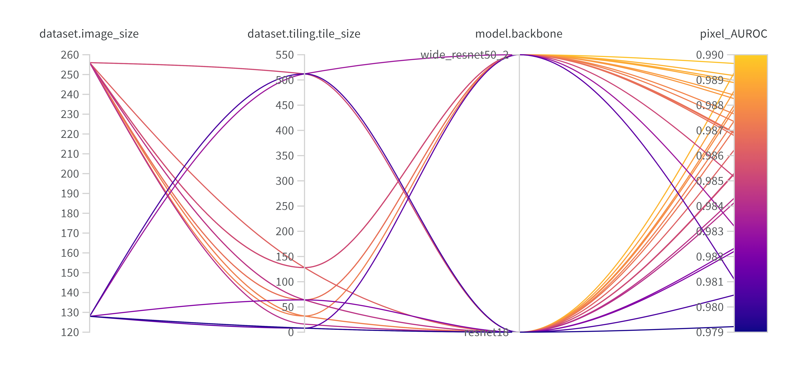

# Hyperparameter Optimization

The default configuration for the models will not always work on a new dataset. Additionally, to increase performance, learning rate, optimizers, activation functions, etc. need to be tuned/selected. To make it easier to run such broad experiments that isolate the right combination of hyperparameters, Anomalib supports hyperparameter optimization using weights and biases.

## YAML file
A sample configuration file for hyperparameter optimization is provided at `tools/hpo/sweep.yaml` and is reproduced below:

```yaml
observation_budget: 10
method: bayes
metric:
  name: pixel_AUROC
  goal: maximize
parameters:
  dataset:
    category: hazelnut
    image_size:
      values: [128, 256]
  model:
    backbone:
      values: [resnet18, wide_resnet50_2]
```

The observation budget defines the total number of experiments to run. The method is the optimization method to be used. The metric is the metric to be used to evaluate the performance of the model. The parameters are the hyperparameters to be optimized. For details on methods other than `bayes` and parameter values apart from list, refer the [Weights and Biases](https://docs.wandb.ai/guides/sweeps/quickstart) documentation. Everything under the `parameters` key overrides the default values defined in the model configuration. Currently, only the dataset and model parameters are overridden for the HPO search.

## Running HPO

:::{Note}
You will need to have logged into a wandb account to use HPO search and view the results.
:::

To run the hyperparameter optimization, use the following command:

```bash
python tools/hpo/wandb_sweep.py --model padim --model_config ./path_to_config.yaml --sweep_config tools/hpo/sweep.yaml
```

In case `model_config` is not provided, the script looks at the default config location for that model.

```bash
python tools/hpo/wandb_sweep.py --sweep_config tools/hpo/sweep.yaml
```

## Sample Output


<figcaption>Sample wandb sweep on Padim</figcaption>
