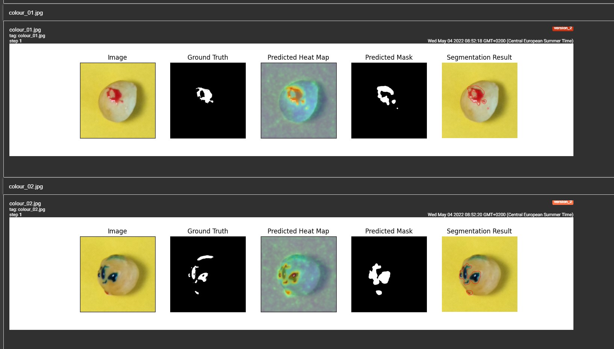
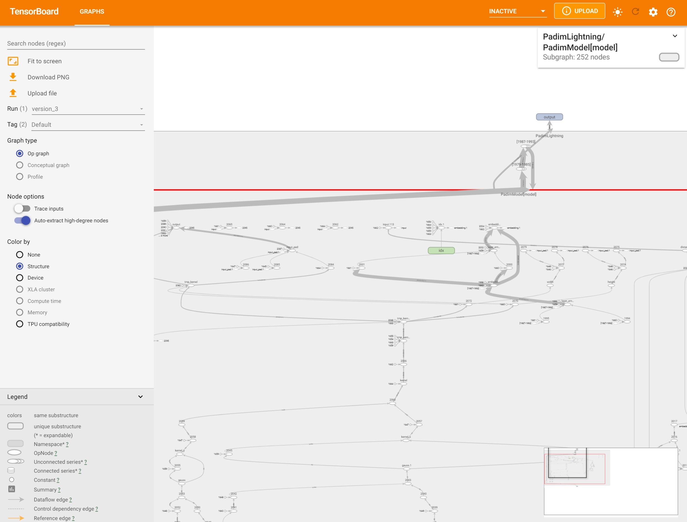

# Logging

Anomalib offers various mechanisms for logging metrics and predicted masks.

## Enabling Logging

These can be enabled using the `logger` parameter in `logging` section of each model configuration file. The available options are `tensorboard`, `wandb` and `csv`.
For example, to log to TensorBoard:

```yaml
logging:
    logger: "tensorboard"
```

 You can also pass a list of loggers to enable multiple loggers. For example:

```yaml
logging:
  logger: [tensorboard, wandb]
  log_graph: false
```

## Logging Images

Anomalib allows you to save predictions to the file system by setting `log_images_to: local`. As of the current version, Anomalib also supports TensorBoard and Weights and Biases loggers for logging images. These loggers extend upon the base loggers by providing a common interface for logging images. You can access the required logger from `trainer.loggers`. Then you can use `logger.add_image` method to log images. For a complete overview of this method refer to our [API documentation](https://openvinotoolkit.github.io/anomalib/api/anomalib/utils/loggers/index.html).

```yaml
logging:
  log_images_to: ["local", "tensorboard", "wandb"]
  logger: [tensorboard, wandb]
  log_graph: false
```

:::{Note}
Logging images to TensorBoard and wandb won't work if you don't have `logger: [tensorboard, wandb]` set as well. This ensures that the respective logger is passed to the trainer object.
:::


<figcaption>Logged Images in TensorBoard Dashboard</figcaption>


<figcaption>Logged Images in wandb Dashboard</figcaption>

## Logging Other Artifacts

To log other artifacts to the logger, you can directly access the logger object and call its respective method. Some of the examples mentioned here might require making changes to parts of anomalib outside the lightning model such as `train.py`.

:::{Note}
When accessing the base logger/`logger.experiment` object, refer to the documentation of the respective logger for the list of available methods.
:::

For example, to log the current model to the TensorBoard and wandb you can update `train.py` as follows:

```python
loggers = get_logger(config)

callbacks = get_callbacks(config)

trainer = Trainer(**config.trainer, logger=logger, callbacks=callbacks)
trainer.fit(model=model, datamodule=datamodule)

for logger in loggers:
    if isinstance(logger, AnomalibWandbLogger):
        # NOTE: log graph gets populated only after one backward pass. This won't work for models which do not
        # require training such as Padim
        logger.watch(model, log_graph=True, log="all")
    elif isinstance(logger, AnomalibTensorBoardLogger):
        logger._log_graph = True
        logger.log_graph(model, input_array=torch.ones((1, 3, 256,256)))
```


<figcaption>Model Graph in TensorBoard Dashboard</figcaption>
